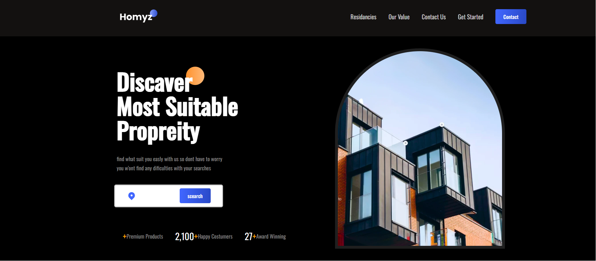
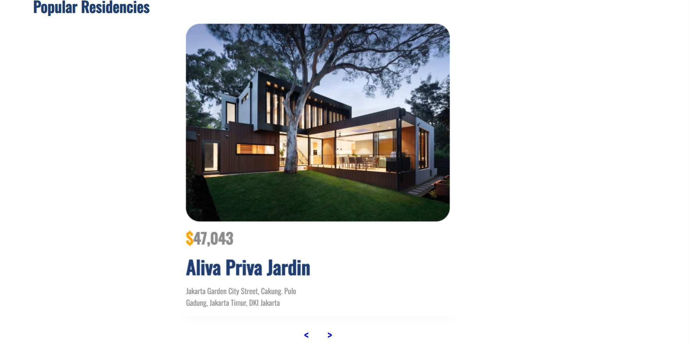
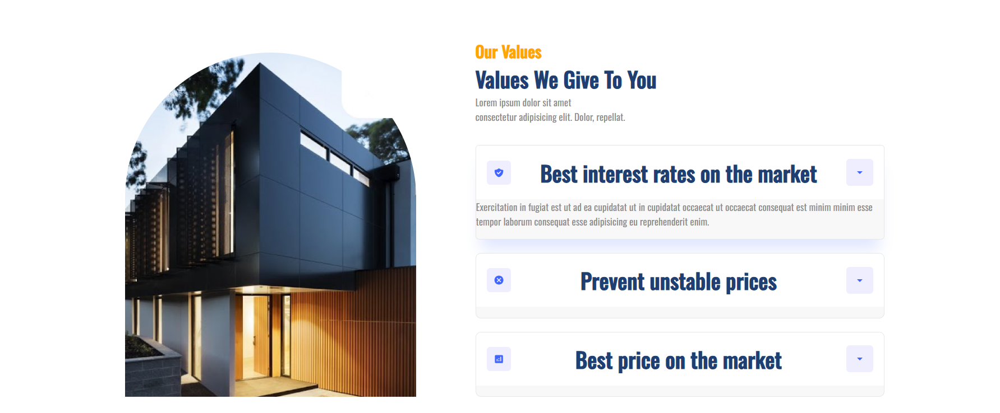
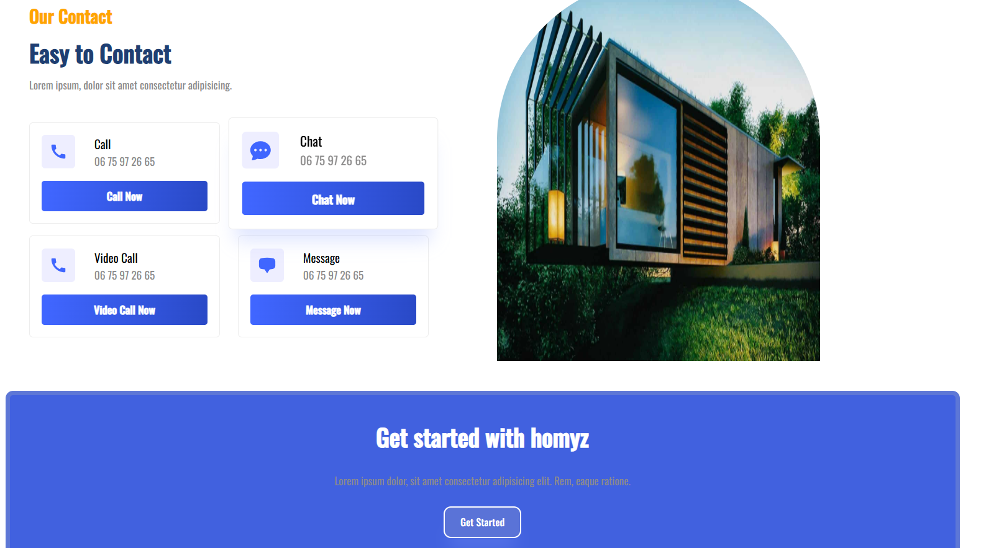

# 🏡 Real Estate Project (React Learning)

📖 About the Project

This is a simple real estate web application built with React as a way to learn and practice frontend development.
The project demonstrates how to build reusable components, handle state, and structure a React app.

✨ Features

🏠 Display a list of properties (title, price, location, image).
 

📄 Property details page (basic info).

🎨 Styled with Tailwind CSS for responsive design.

⚛️ Built entirely with React functional components and hooks.

## 📚 What I Learned
Setting up a React project with Vite

Creating and reusing React components

Managing state with React hooks (useState, useEffect)

Basic props drilling for passing data

Styling with TailwindCSS

Handling lists and conditional rendering

